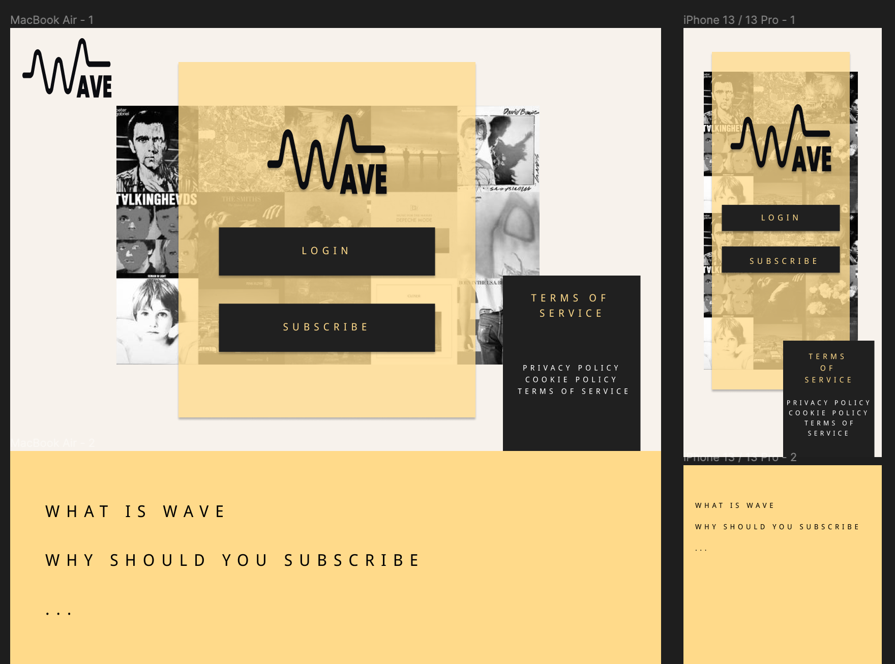
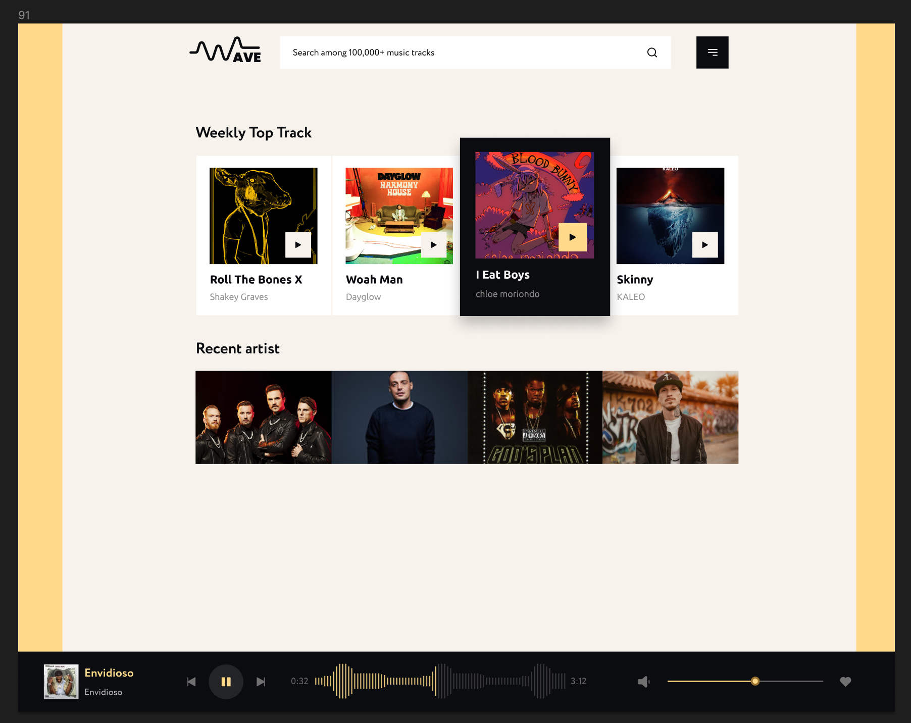

## Wave Music Streaming 

## The Team

Frontend: [Ronnie James](https://github.com/ronniejamestorres), [Nathalie](https://github.com/sanbimu) 
 
Backend: [Jo](https://github.com/buidlor), [Loic](https://github.com/LoicFrancotte)

## The Project

 
 
 

We are developing a music streaming platform similar to Spotify, offering users access to a vast library of music from various artists and genres.
 
Our platform will provide playlists, and rating features to enhance the user experience. 
 
We aim to offer a seamless and enjoyable listening experience across multiple devices, including web and mobile.

## Technologies

`React`, `Vite`, `Typescript`, `Tailwind`, `Axios`, `MongoDB`, `NodeJs-Express`, `Mongoose`

## Sources

Spotify API 
