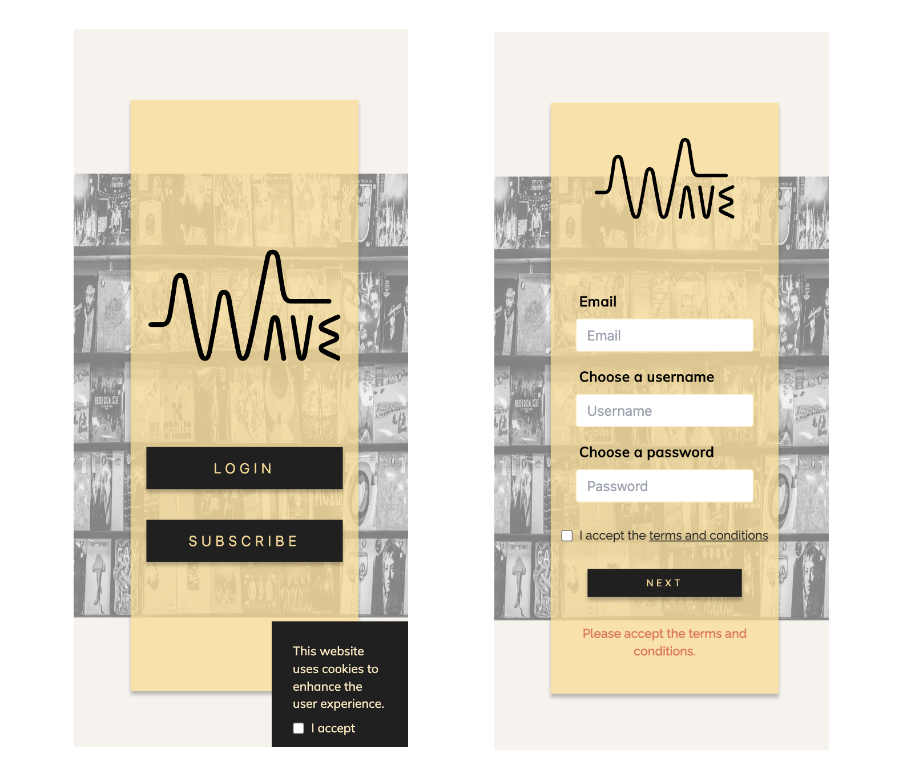

# Wave Music Streaming 

## Description

[Wave](http://wave.nodestarter.eu:3000/) is a music streaming platform offering users access to a vast library of music from various artists and genres. To access the Wave catalog, users must register, pay for their subscription, and log in.
 
 
 

## Technologies

`React`, `Vite`, `Typescript`, `Tailwind`, `Axios`, `NodeJs-Express`, `MongoDB`, `Mongoose`

## Sources

[Spotify API ](https://developer.spotify.com/documentation/web-api/)
 
[Dribbble](https://dribbble.com/shots/15433063-Wave-Music-Streaming-Dashboard)

